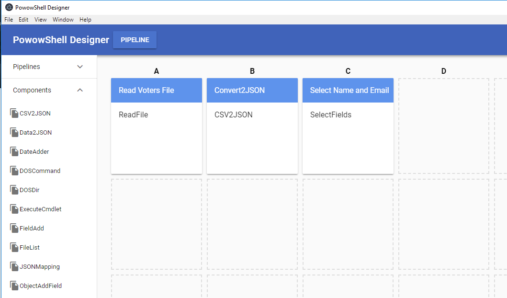
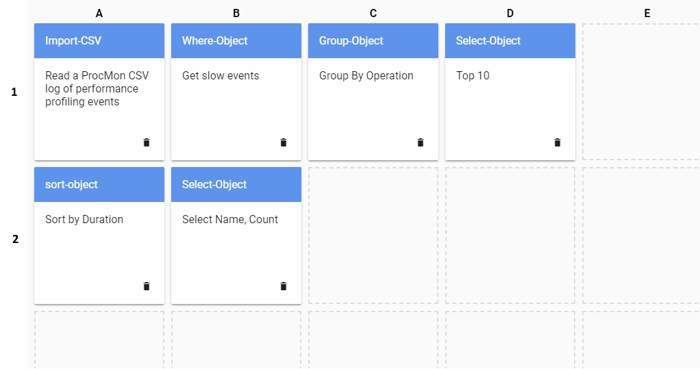

# PowowShell

Ever dreamed of drawing a visual data flow and pressing "Play" to see it run?
I have, and that's why I dreamed up PowowShell: a graphical designer powered
by PowerShell.

## The Vision

Imagine dragging a CSV File component into your pipeline, connecting it to a Database component and pressing "Play" to load data into your database. What about getting an email out if some records don't load? Drag in an Email component and connect it to the Errors output of your Database component. Call a web service? Sure, just use a Transform component to map your data to the format required.

## The Strategy

### Power
PowerShell is a powerful shell with a rich set of features. It has established mechanisms for
producing output, writing errors, verbose logging (-Verbose), dry runs (-WhatIf), parameter goodies (types, validation, defaults) etc.
We won't re-invent the wheel but will use these mechanisms wherever possible.
We leverage the great wealth of annotation powershell provides through it's

### Piping
One really powerful aspect of PowerShell is the ability to pipe objects (instead of just text).
For the moment, we are going to stick with plain text for reasons of simplicity. The problem is that 2 components have to exactly agree on the object format which is complicated. By supporting text and text/* subtypes (e.g. json, xml, ...) we keep things simple and components can do their own parsing and validation of input, ignoring whatever they don't need.

### Transparency
Transparency (or maintainability) is a big issue: it is important that a pipeline designer (or runner) knows what their pipeline is doing. For this reasons we build pipelines in two modes: production and trace:
* In production mode, data is passed between components in memory which is faster.
* In trace mode data is dumped to a file between components which is slower but allows us to better debug[1] what is going on.

Additionally pipelines and components can be verified and tested by running them in special modes which show they are working but without any side-effects or real "damage" being done.

[1] Of course, pipelines are also "just" powershell scriptlets and so can be debugged step by step in a tool like VS Code  or the PowerShell ISE.

### IDE

The point of all this fuss is that if we can neatly define and delineate components and pipelines we can build a super-simple and super-sexy IDE which allows building and testing of pipelines with ease and maximum coolness.

Check out an early prototype of the IDE here:

https://cawoodm.github.io/powowshell/ide/



This demo is basically just look and feel. There is no loading, running and saving of pipelines.

### Pipelines

Pipelines are where the magic happens. Here you connect your components together in a sequence. The pipeline is run in columns: Column A is run, then B etc. In each column the components are executed from top to bottom so you'd have: A1 -> B1 -> B2 -> C1 -> C2 -> C3 -> D1

 

 A pipeline is technically a pipeline.json file which describes the components it uses and how they are wired together. Pipelines also have globals which components can read and write as well as parameters which components may only read. These parameters are a way of er... parameterizing the pipeline so the same pipeline can do different useful things.

### Components

The diagram shows the 4 types of components (source, transform, destination and script) and how data can flow between them. It also shows how script components just run, needing no input and producing no output. Indeed you can use a pipeline to just run some commands in sequence.

## Installation

Download the repository and build and run the sample pipeline as follows:
```
git clone git@github.com:cawoodm/powowshell.git
cd powowshell
install
```
This will create `pow.cmd` which you should copy to your PATH so you can run it from anywhere.
Let's check if we're up and running by displaying the version:
```
pow version
```
Now we'll build and run the example pipeline:
```
pow build examples\pipeline1
pow run examples\pipeline1
```

This builds and runs a pipeline based on it's definition in `pipeline.json`.
The result of `build` is a powershell script `run_prod.ps1`. Running this runs the pipeline.
The pipeline does the following:
* Step A: Read a list of voters from the file in `data\voters.txt` as text
* Step B: Convert the text to JSON
* Step C: Select only the name. age and email fields

The result is a JSON string representing a list of voters.

We'll be developing this pipeline by adding new steps like:

* Filtering only young voters (age < 30)
* Sending each voter an email

## POW commands
* `pow version`: Print version information
* `pow build <path to pipeline directory>`: Build a pipeline (creates .ps1 file)
* `pow clean <path to pipeline directory>`: Delete a buildd pipeline (i.e. all .ps1 files and the trace\ subdirectory)
* `pow verify <path to pipeline directory>`: Verify a pipeline by running it in PowerShell's "dry run" (-WhatIf) mode
* `pow run <path to pipeline directory>`: Run a pipeline
* `pow run <path to pipeline directory> -Trace -Verbose`: Run a pipeline with verbose output and each step's output logged to trace directory
* `pow clean <path to pipeline directory>`: Delete a buildd pipeline (i.e. all .ps1 files and the trace\ subdirectory)
* `pow inspect <path to component .ps1>`: Inspects a component (TODO: validate, check and test component)
* `pow components <path to components directory>`: List components in a folder

## PowerShell

PowerShell is a cross platform, open source shell designed by Microsoft which
runs on Windows, Mac and Linux. It's powerful and fun to use and becoming much
more than a utility merely for IT departments. It's designed around discreet
functionality called "CmdLets" which generally accept and provide input and 
output on the pipeline.

## What does PowowShell do?

PowowShell aims to let you design and run workflows (called Pipelines) which
consist of individual powershell components. These components are joined together
in a sequence of steps with data from one step feeding into another.

What each step does is up to you. You can use existing powershell Cmdlets, write
your own advanced functions and scripts, or even call any command line utility
you like curl, awk, batch files, what every you have. Because components are written
in powershell (yes you do have to write code to make components) you can also tap into
the full power of the .NET framework very easily to do just about anything.

## Component Definition

A component is just a script with some basic requirements
* It must declare its PARAMETERS with types
* If it accepts INPUT, it gets the data as a String from the pipeline (stdin) with parameter $InputObject
* If it provides OUTPUT, it writes it's output as a String to the pipeline (stdout) with Write-Output
* It writes any errors to the pipeline (stderr) with Write-Error
* It has annotated help describing it's function and parameters

As you can see, PowowShell expects components to behave in a certain way. This may be a pain but it makes things easier later. One of the weaknesses of PowerShell is that very few CmdLets can interact because most have their own special object types. You can't pass the output of one object type to another easily. PowowShell ensures each component can only write a String. This may sound limiting but since you can put JSON (or whatever) into that string, you retain all of the flexibility of objects. Of course if one component outputs JSON, the next component downstream needs to accept JSON or you need to put a Transform component in between.

Let's look at some [component examples](docs/Component-Examples.md).

