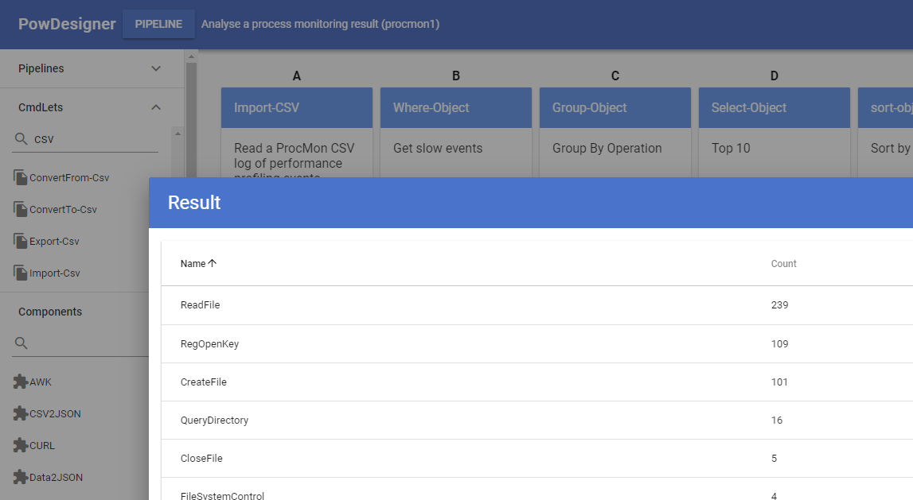

# PowowShell

Ever dreamed of drawing a visual data flow and pressing "Play" to see it run? I have, and that's why I dreamed up PowowShell: a graphical designer powered by PowerShell.

## The Vision

Imagine dragging a CSV File component into your pipeline, connecting it to a Database component and pressing "Play" to load data into your database. What about getting an email out if some records don't load? Drag in an Email component and connect it to the Errors output of your Database component. Call a web service? Sure, just use a Transform component to map your data to the format required.

## Getting Started
Note, the software is pre-alpha, proof of concept so be ready for some work to get things sailing smoothly.
The IDE require certain features (spawn powershell) in NodeJS v11 or higher so get Electron 5 or higher.

1. Clone this repository with git: `git clone git@github.com:cawoodm/powowshell.git`
2. Run `install` from DOS/CMD to install the `pow` command for powershell
3. Start `powershell` and then run `pow cmdlets generate` so that the IDE knows all your installed cmdlets and functions
3. To use the IDE install electron globally: `npm install -g electron`
4. `cd ide` then install dependencies `npm i` and compile `npm build`
4. Run the IDE: `npm start` or `electron .`

## Examples
This repo includes an 2 example pipelines in `./examples/` as well as a bunch of components.

If you type `pow version` you should see version information and `pow help` will get you started with commands.

Type `pow workspace ./examples` to switch to the examples workspace and save you typing the full path to pipelines.

The first example can be built with `pow build !pipeline1` and then run with `pow run !pipeline1`. The `!` references the current workspace.

The pipeline1 consists of 3 steps:

1. Read a voters.txt file with a list of people
2. Convert the delimited file to json
3. Select only the name and email and output them as json

Not very spectacular sure but this is a simple example and the principle should be clear:

1. Steps are executed in a fixed order A1, A2, A3...B1, B2...C1...
2. Steps can accept piped input from previous steps
3. The pipeline can be run with different parameters making it reusable

## The Strategy

### Power
PowerShell is a powerful shell with a rich set of features. It has established mechanisms for
producing output, writing errors, verbose logging (-Verbose), dry runs (-WhatIf), parameter goodies (types, validation, defaults) etc.
We won't re-invent the wheel but will use these mechanisms wherever possible. We leverage the great wealth of annotation powershell provides through it's special comments system to describe our components and to make them interoperate.

### Piping
One really powerful aspect of PowerShell is the ability to pipe objects (instead of just text like normal shells). For the moment, we are going to stick with plain text for reasons of simplicity. The problem is that 2 components have to exactly agree on the object format which is complicated and the main reason why integration is hard and you need programmers.

By supporting text and text/* subtypes (e.g. json, xml, ...) we keep things simple and components can do their own parsing and validation of input, ignoring whatever they don't need. As an example, a DeleteFile component will accept any dataset which has objects with a .Path property no matter their type.

### Transparency
Transparency (or maintainability) is a big issue: it is important that a pipeline designer (or runner) knows what their pipeline is doing. For this reasons we build pipelines in two modes: production and trace:
* In production mode, data is passed between components in memory which is faster.
* In trace mode data is dumped to a file between components which is slower but allows us to better debug[1] what is going on.

Additionally pipelines and components can be verified and tested by running them in special modes which show they are working but without any side-effects or real "damage" being done.

[1] Of course, pipelines are also "just" powershell scriptlets and so can be debugged step by step in a tool like VS Code  or the PowerShell ISE.

### IDE

The point of all this fuss is that if we can neatly define and delineate components and pipelines we can build a super-simple and super-sexy IDE which allows building and testing of pipelines with ease and maximum coolness.

Check out a prototype of the IDE here:

https://cawoodm.github.io/powowshell/ide/

This demo is basically just look and feel. There is no loading, running and saving of pipelines because PowerShell does not run in the browser. However, the IDE is available as an Electron app which allows you to load, save and run pipelines.

### Pipelines

Pipelines are where the magic happens. Here you connect your components together in a sequence. The pipeline is run as we read code: left to right, top to bottom: A1 -> B1 -> C1 -> D1 -> A2 -> B2

 
 

 A pipeline is just a pipeline.json file which describes the components it uses and how they are wired together. Pipelines also have globals which components can read and write as well as parameters which components may only read. These parameters are a way of er... parameterizing the pipeline so the same pipeline can do different useful things.

 The IDE produces the pipeline.json but you can also hack it together by hand - or write a better IDE!

### Components

Components are .ps1 scripts which can wrap powershell, batch, python, perl or any language you like: any CLI can be wrapped, described and documented as a component and used in a pipeline. In addition, all installed PowerShell Cmdlets and Functions are automatically available.

## POW commands
* `pow version`: Print version information
* `pow help <command>`: Help using a command
* `pow build <pipeline>`: Build a pipeline (creates .ps1 file)
* `pow verify <pipeline>`: Verify a pipeline by running it in PowerShell's "dry run" (-WhatIf) mode (supports -Verbose)
* `pow run <pipeline>`: Run a pipeline
* `pow run <pipeline> -Trace -Verbose`: Run a pipeline with verbose output and each step's output logged to trace directory
* `pow run <pipeline> @params`: Run a pipeline passing in parameters (using splatting)
* `pow clean <pipeline>`: Delete a built pipeline (i.e. all .ps1 files and the trace/ subdirectory)
* `pow inspect <path to component .ps1>`: Inspects a component (TODO: validate, check and test component)
* `pow components <path to components directory>`: List components in a folder

## POW Command Examples

Run a pipeline, passing in parameters
`pow run ./examples/pipeline1 "@{DataSource='./data/names.txt'}"`

## Workspaces
You may have several projects which you can organize into folders called "workspaces".
Each workspace should contain one components/ subdirectory and a subdirectory for each of your pipelines.
PowowShell comes with an examples/ folder - let's define that as our current workspace:
`pow workspace ./examples`
If we do this, we'll save some typing because we can now type:
`pow inspect !mycomponent`
instead of
`pow inspect ./examples/components/mycomponent.ps1`

## PowerShell

PowerShell is a cross platform, open source shell designed by Microsoft which
runs on Windows, Mac and Linux. It's powerful and fun to use and becoming much
more than a utility merely for IT departments. It's designed around discreet
functionality called "CmdLets" which generally accept and provide input and
output on the pipeline.

## What does PowowShell do?

PowowShell aims to let you design and run workflows (called Pipelines) which
consist of individual powershell components. These components are joined together
in a sequence of steps with data from one step feeding into another.

What each step does is up to you. You can use existing powershell Cmdlets, write
your own advanced functions and scripts, or even call any command line utility
you like curl, awk, batch files, what every you have. Because components are written
in powershell (yes you do have to write code to make components) you can also tap into
the full power of the .NET framework very easily to do just about anything.

## Component Definition

A component is just a script with some basic requirements
* It must declare its INPUT, OUTPUT and PARAMETERS with full types
* If it accepts INPUT, it gets the data from the pipeline (stdin) with parameter $InputObject
* If it provides OUTPUT, it writes it's output to the pipeline (stdout) with Write-Output
* It writes any errors to the pipeline (stderr) with Write-Error
* It writes any warnings to the pipeline (stderr) with Write-Error
* It has annotated help describing it's function and parameters

As you can see, PowowShell expects components to behave in a certain way. This may be a pain but it makes things easier later. One of the weaknesses of PowerShell is that very few CmdLets can interact because most have their own special object types. You can't pass the output of one object type to another easily. PowowShell allows you to transmogrify objects into other types of objects. You can also just pass strings (e.g. JSON) around. Of course if one component outputs JSON, the next component downstream needs to accept string of type application/json or you need to put a Transform component in between.

To see if your component is valid for PowowShell we have the `inspect` command which parses the component.
`pow inspect ./examples/components/CSV2JSON.ps1`
This will return an object representing the component. You could easily generate a JSON of this:
`pow inspect ./examples/components/CSV2JSON.ps1 | ConvertTo-Json > ./examples/components/CSV2JSON.json`

Let's look at some [component examples](docs/Component-Examples.md).

